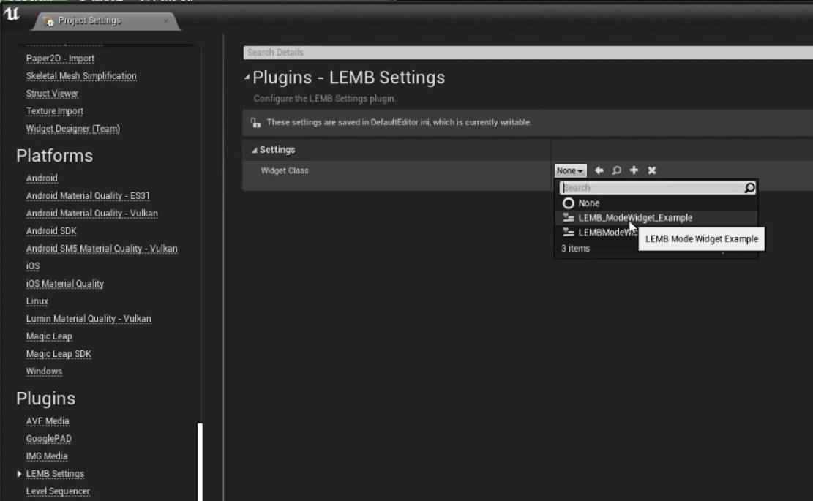

# LEMB (Level Editor Mode with Blueprints) [made by Ramón Janousch](https://www.ramonjanousch.com/)

## About

This is an Unreal Engine 4 template project for Level Editor Modes.
It is possible to use just blueprints for the level editor mode! No C++ required!
This project can also be used as a base for more advanced level editor modes, made in C++. In this case the widget creation with slate could be skipped!

* No C++ skills required!
* Dynamic widget update inside the editor!
* Simple to use!

This template will help you to build an level editor mode as quickly as possible with or without C++.

## [How It Works]()

1. Choose the branch for the unreal version you want.
2. Clone or download the repository
3. Start the project.
4. Optional: Create a new widget based on the LEMB Mode Widget.
5. Go inside the project settings (LEMB Settings) and select a Mode Widget.
6. Open the level editor mode (default shortcut is Shift + 2).

## Usage

### Unreal Engine 4
This is an editor only plugin.

## Configuration Options

You can change the mode widget class in the settings.

 
 
 
 
 
 
 
 

## How to Contribute

1. Clone repo and create a new branch
2. Make changes and test
3. Submit Pull Request with comprehensive description of changes

## Donations

This is free, open-source project. If you'd like to support the development of future projects, or say thanks for this one, you can donate BTC at `18zzhkgheRhxHCUbydeE9Dco8mJeEKfXrY`.

## License

LEMB is licensed under the terms of the MIT
license and is available for free.

